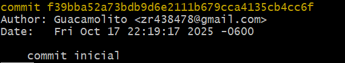
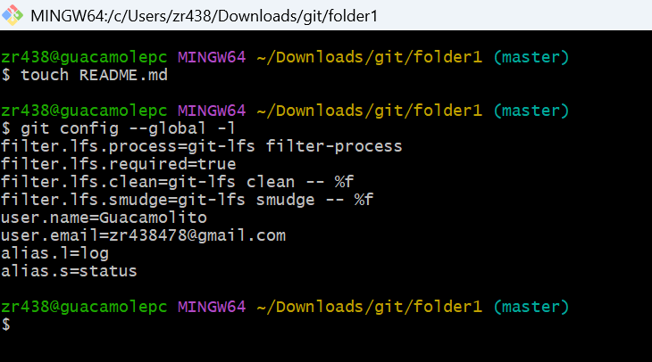
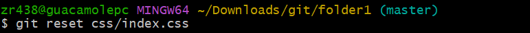
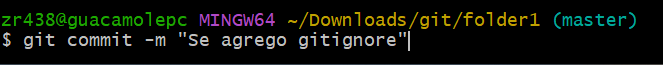
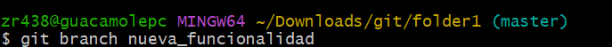
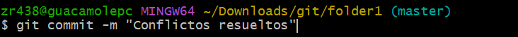
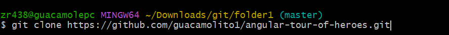
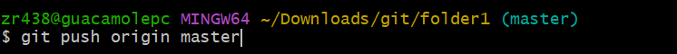

# Mi Proyecto Git

## 1. Qué aprendí del video
A través del video, aprendí los conceptos básicos y avanzados de Git y GitHub, incluyendo:
- Cómo inicializar un repositorio y vincularlo con GitHub.
- Hacer commits, gestionar el área de staging, y ver el historial con `git log`.
- Crear y usar alias para simplificar comandos.
- Renombrar, eliminar y deshacer cambios con `git mv`, `git rm`, y `git reset`.
- Configurar un archivo `.gitignore` para ignorar archivos no deseados.
- Trabajar con ramas, hacer merges, y resolver conflictos.
- Clonar repositorios, actualizarlos con `git pull`, y colaborar con forks y pull requests.

## 2. Comandos utilizados
A continuación, detallo los comandos que usé para completar la actividad, con capturas de pantalla que muestran cada paso:

### Paso a paso
1. **Inicialización del repositorio**:
   ```bash
   git init

2. **Commits y staging**:
git commit -m "Primer commit: README inicial"
git log --oneline

3. **Alias**:
git config --global alias.s "status"
git s

4. **Git mv, rm, reset**:
git mv README.md LEEME.md
git rm prueba.txt
git reset LEEME.md

5. **.gitignore**:
touch .gitignore
git add .gitignore
git commit -m "Añadido .gitignore"

6. **Ramas y merge**:
git checkout -b nueva-funcionalidad
git add feature.txt
git commit -m "Añadida nueva funcionalidad"
git checkout main
git merge nueva-funcionalidad

7. **Resolución de conflictos**:
git add LEEME.md
git commit -m "Resuelto conflicto de merge"

8. **Git clone y pull**:
git clone https://github.com/tu-usuario/mi-proyecto-git.git
git pull origin main

9. **Fork y Pull Request**:
git checkout -b mi-rama
git add archivo.txt
git commit -m "Cambio en el fork"
git push origin mi-rama


## 3. Dificultades y soluciones
- Dificultad: No entendía cómo resolver conflictos de merge.
  - Solución: Aprendí a identificar los marcadores de conflicto (<<<<<<<, =======, >>>>>>>) en el archivo, editarlo manualmente, y completar el merge con git add y git commit.

- Dificultad: Subí accidentalmente un archivo que no quería rastrear.
  - Solución: Usé git rm --cached para quitar el archivo del control de versiones y lo añadí al .gitignore.

- Dificultad: Problemas con la autenticación al hacer git push.
  - Solución: Generé un token de acceso personal en GitHub y lo usé para autenticarme.